# Create a cognitive moderator chatbot for anger detection, natural language understanding and explicit images removal

## WARNING: This repository is no longer maintained. 

This repository will not be updated. The repository will be kept available in read-only mode.

In this code pattern, we will create a chatbot using IBM functions and Watson services. The chatbot flow will be enhanced by using  Natural Language Understanding to identify angry and disrespectful messages

When the reader has completed this journey, they will understand how to:

* Create a chatbot that integrates with Slack via IBM Functions
* Use Watson Natural Understanding to detect emotions in a conversation
* Identify entities with Watson Natural Language Understanding

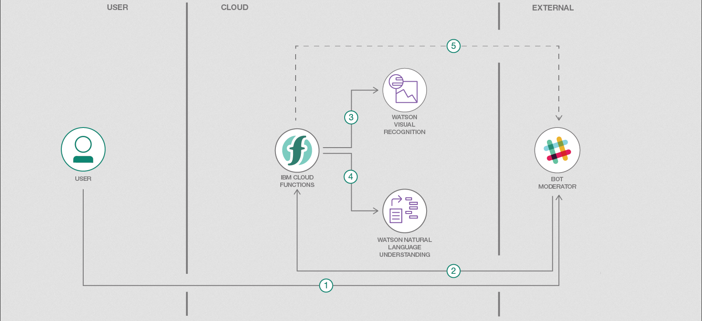

## Flow
1. The user interacts from the Slack app and either sends a text or uploads an image.
2. The text or image that is used in the Slack for conversation is then passed to an IBM function API by a bot. The API is a call to an IBM Function that categorizes the text or images based on the response of Watson Visual Recognition or Watson Natural Language Processing.
3. (Optional) Watson Visual Recognition categorizes the uploaded image using default and explicit classifier. (Deprecated, see [Maximo Visual Inspection](https://www.ibm.com/support/pages/ibm-maximo-visual-inspection) instead).
4. Watson Natural Language Processing categorizes the text, if text is send as part of slack communication.
5. IBM function then gets the response and if the text is not polite, a message is sent by the bot to the Slack user to be more polite using [Slack post message API](https://api.slack.com/methods/chat.postMessage). If the image used is explicit, the image will be deleted by the IBM function using [Slack files delete API](https://api.slack.com/methods/files.delete).


## Included components

* [IBM Functions](https://cloud.ibm.com/openwhisk): IBM Cloud Functions (based on Apache OpenWhisk) is a Function-as-a-Service (FaaS) platform which executes functions in response to incoming events and costs nothing when not in use.
* [IBM Watson Natural Language Understanding](https://www.ibm.com/watson/developercloud/natural-language-understanding.html): Analyze text to extract meta-data from content such as concepts, entities, keywords, categories, sentiment, emotion, relations, semantic roles, using natural language understanding.

## Featured technologies

* [Slack Apps](https://api.slack.com/slack-apps) Customize functionality for your own workspace or build a beautiful bot to share with the world.
* [Slack Bots](https://api.slack.com/bot-users) Enable conversations between users and apps in Slack by building bots.

# Watch the Video
> Note: The video shows the Slack bot using Watson Visual Recognition to remove explicit images. Currently Watson Visual Recognition is discontinued. Existing instances are supported until 1 December 2021, but as of 7 January 2021, you can't create instances. Any instance that is provisioned on 1 December 2021 will be deleted. Please view the [Maximo Visual Inspection trial](https://www.ibm.com/support/pages/ibm-maximo-visual-inspection) as a way to get started with image classification.

[](https://youtu.be/9c7NuamK8JA)


# Steps

1. [Clone the repo](#1-clone-the-repo)
2. [Create Natural Language Understanding service with IBM Cloud](#2-create-natural-language-understanding-service-with-ibm-cloud)
3. [Create Slack App and Bot for a workspace](#3-create-slack-app-and-bot-for-a-workspace)
4. [Deploy the function to IBM Cloud](#4-deploy-the-function-to-ibm-cloud)
5. [Test using slack](#5-test-using-slack)


## 1. Clone the repo

Clone the `cognitive-moderator-service` repo locally. In a terminal, run:

```
$ git clone https://github.com/IBM/cognitive-moderator-service
$ cd cognitive-moderator-service
```

## 2. Create natural language understanding service with IBM Cloud

If you do not already have a IBM Cloud account, [sign up for IBM Cloud](https://cloud.ibm.com/registration).
Create the following services:

* [**Watson Natural Language Understanding**](https://cloud.ibm.com/catalog/services/natural-language-understanding)

> Make note of the service credentials when creating services which will be later used when creating a function.

## 3. Create Slack App and Bot for a workspace

* Go to Your Apps using the following link: https://api.slack.com/apps and click `Create New App` and fill out the `App Name` and the `Workspace` you would like to use it for and click `Create App`.

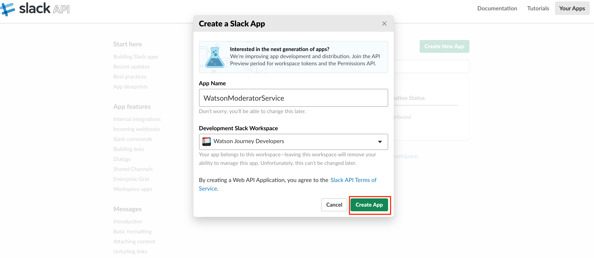

* After the app is created, you will be taken to a page where you can configure the Slack app. Make note of **`Verification Token`**  which will be used later in the function.
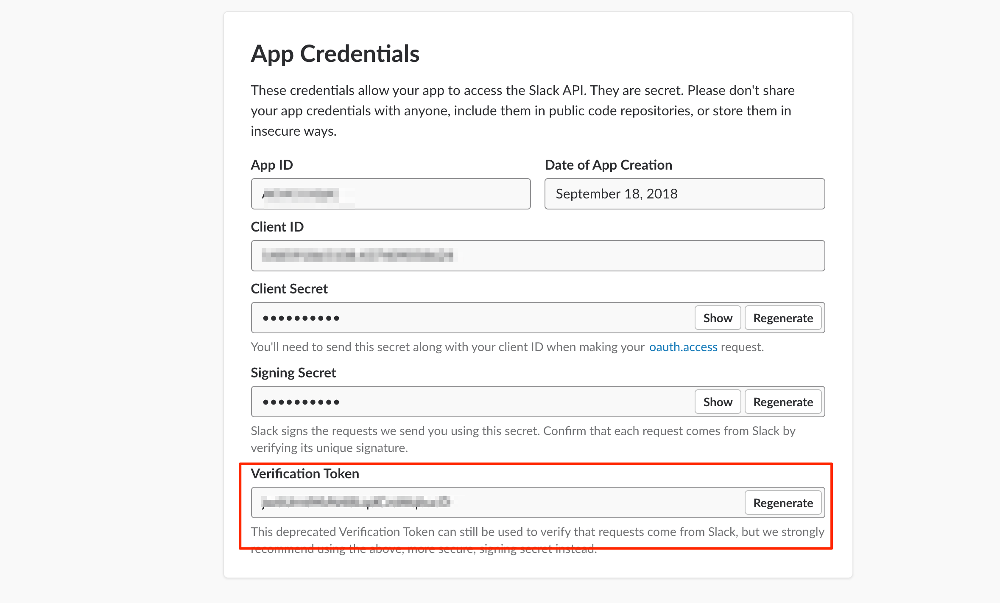

* Create bot user from `Bot Users`. Provide a `Display Name` and `Default Username` for the bot and click `Save Changes`.
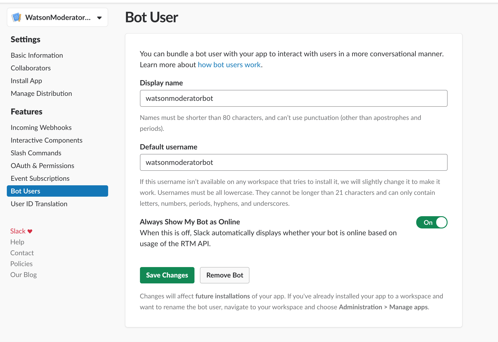

* From `OAuth and Permissions`, Save the `OAuth Access Token` for later use by the IBM cloud function.
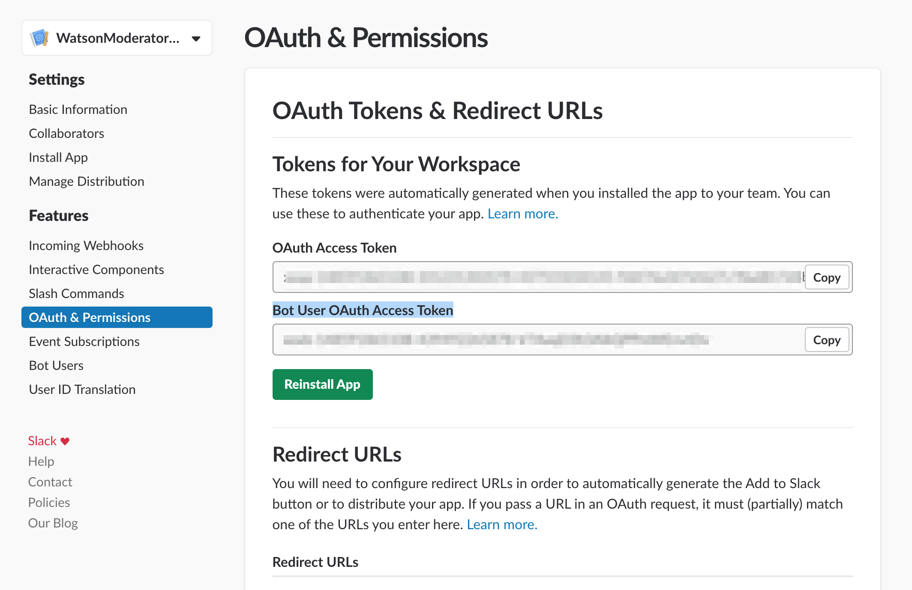

Select `Permissions Scopes` that will be used by the bot that we will be creating next.

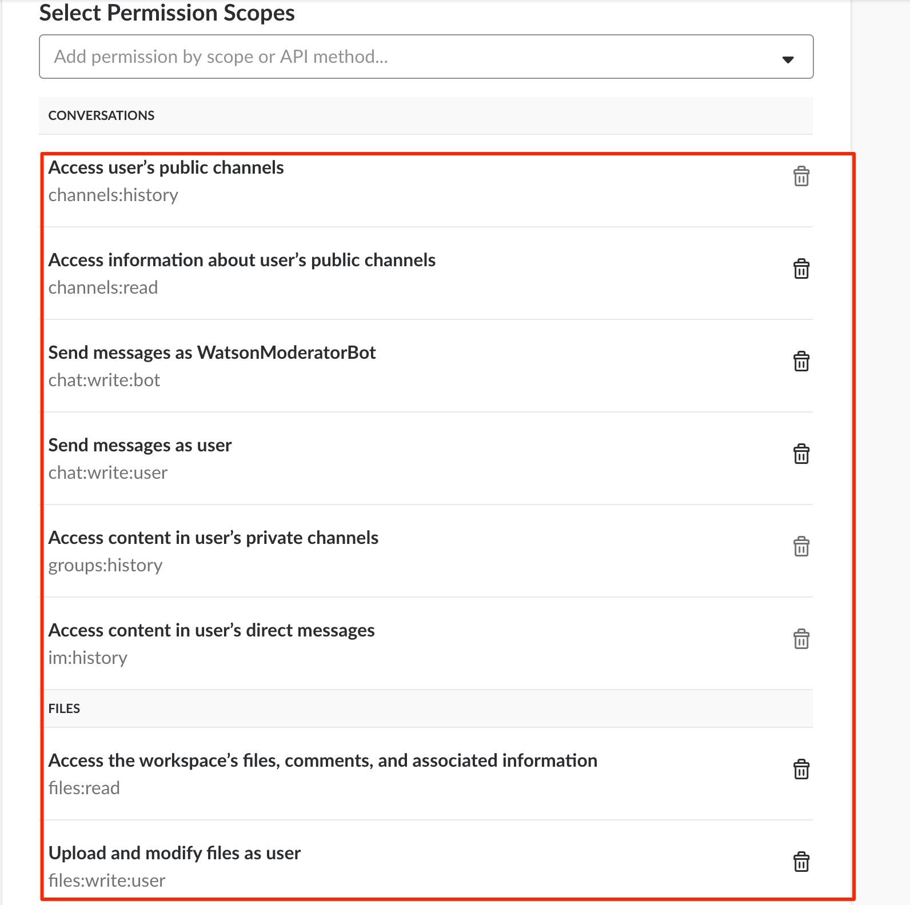

* Once this is done make sure you `reinstall or install app` from Install App section.
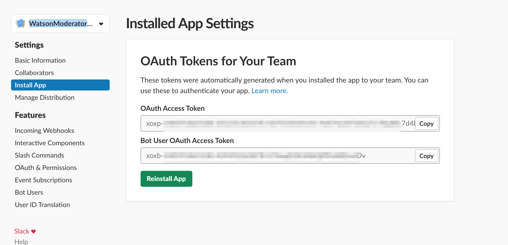

## 4. Deploy the function to IBM Cloud
Once the credentials for both IBM Cloud and Slack are noted, we can now deploy the function to IBM Cloud.

Copy `params.sample.json` to `params.json` using `cp params.sample.json params.json` and replace the values with the credentials you have noted in proper place holders. You can leave the `VISUAL_RECOGNITION_IAM_APIKEY` blank.

> NOTE: `NLU_URL` is optional. You can also remove the `NLU_URL` key/value from the below json and it uses the global URL part of the SDK.

```
{
    "NLU_APIKEY": "<NLU apikey>",
    "NLU_URL": "<NLU url>",

    "VISUAL_RECOGNITION_IAM_APIKEY": "<Visual Recognition IAM API Key, or you can leave this blank>",

    "SLACK_VERIFICATION_TOKEN": "<Slack Verification Token>",
    "SLACK_ACCESS_TOKEN": "<Slack OAuth Access Token>",

    "SLACK_MESSAGE_POST_URL": "https://slack.com/api/chat.postMessage",
    "SLACK_MESSAGE_DELETE_URL": "https://slack.com/api/files.delete"
}

```

Install the [IBM cloud CLI)(https://cloud.ibm.com/docs/cli/index.html#overview) if you haven't already, including the [IBM Cloud Functions CLI plugin](https://cloud.ibm.com/openwhisk/learn/cli).

* Deploy the function to IBM cloud. Make sure you are in the project directory then, from Terminal run:

```
ibmcloud wsk action create WatsonModerator functions/bot_moderator_function.py --param-file params.json --kind python:3.7 --web true

```
>Note: The above command pushes the function with python 3.7 runtime and the function is written to suit the runtime. 

>If you want to use python 3.6, comment out or remove the below code:

> `response = response.get_result()` (line 122) from the function and then run

> `ibmcloud wsk action create WatsonModerator functions/bot_moderator_function.py --param-file params.json --kind python:3.6 --web true`

* After the function is created, you can run following command to update the function if there are any changes:

```
ibmcloud wsk action update WatsonModerator functions/bot_moderator_function.py --param-file params.json --kind python:3.7
```

Now you can login to IBM Cloud and see the function by going to `IBM functions`, click `Actions`. You should see the function in the list of functions in this page.
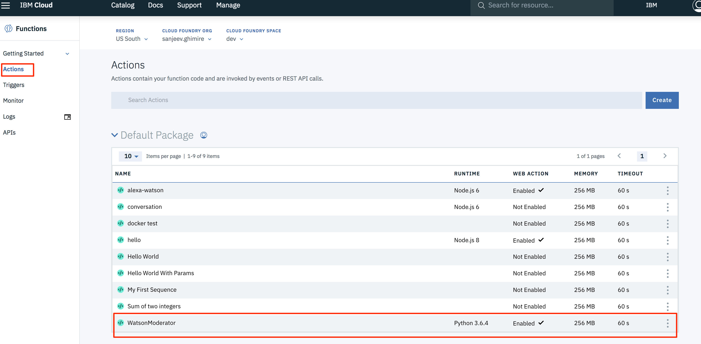


* Expose the function so that it can be accessed using an API

1. Click the `APIs` from the IBM Cloud Functions page and click  `Create Managed API`.
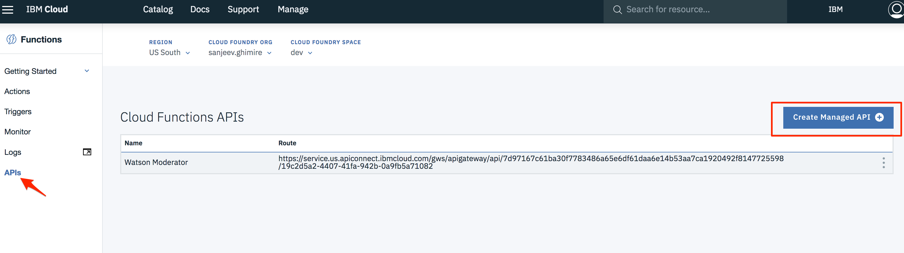

2. Provide `API Name`, `Base path for API`
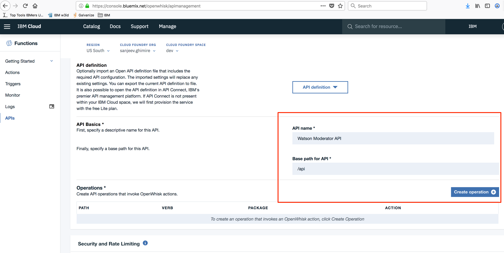

3. Click `Create Operation` and in the dialog box that appears, provide the following like in the figure below and click `create`. Then click `Save & Expose` at the bottom right.
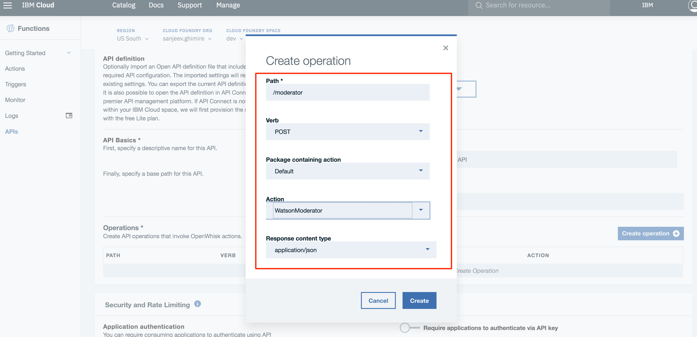

4. From the `API Explorer` select the `API URL` and save it for later use.
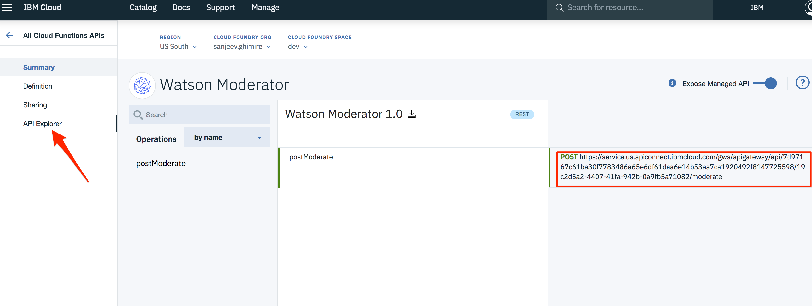

* Add `Event Subscriptions` for your app by clicking on to `Add features and functionality` from the main page of the app.
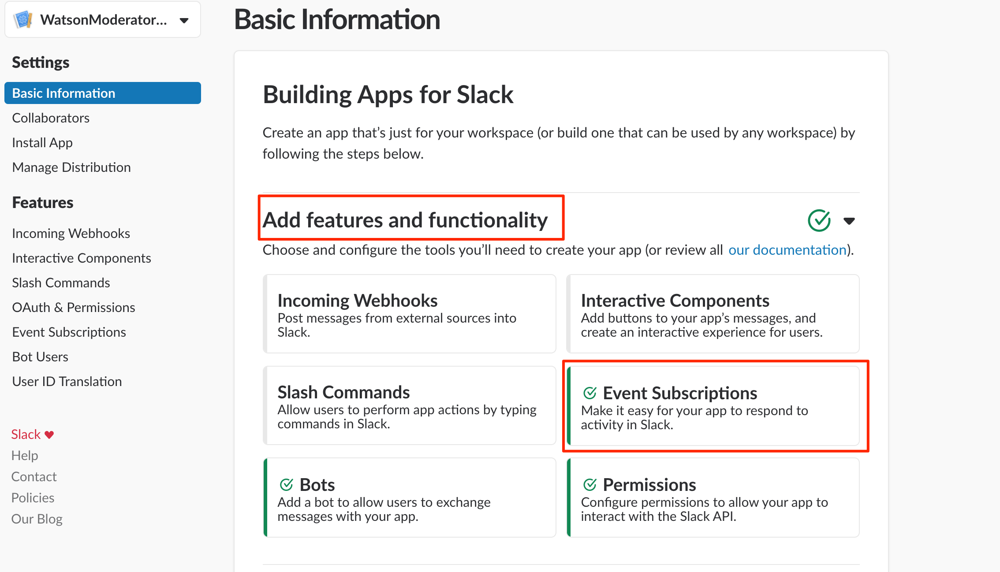

Add the `API URL` of the function from IBM Cloud to the `Request URL` in Slack App

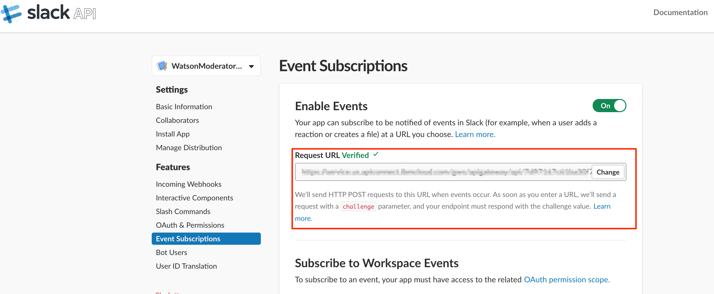

> Make sure the URL is verified. To be verified the API needs to return a response to the request that Slack sends to this `Request URL` with `challenge` parameter.

In the `Event Subscriptions` page, enable it by turning `on` using the `on/off` toggle button and `Add Workspace and Bot Events` in subsequent sections. Add Following events for both:

1. message.channels
2. message.group
3. message.im

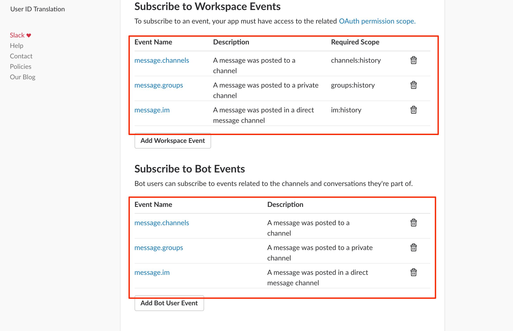

> Note that you need to `Reinstall App` after you make any changes to the app for example: `Request URL`.

## 5. Test using slack

* **Test Case: Usage of rude messages**

Now you can use slack to test. If rude message are sent which NLU categorized as `anger` or `disgust` you will see a message from the `bot` that you created from Slack.

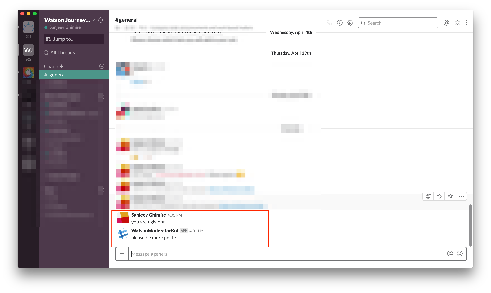

<!-- * **Test Case 2: Usage of explicit image**

Upload an image that's explicit.

> An explicit image is an image that contains objectionable or adult content that may be unsuitable for general audiences.

When you upload an **explicit** image, the image will be deleted from the Slack conversation.

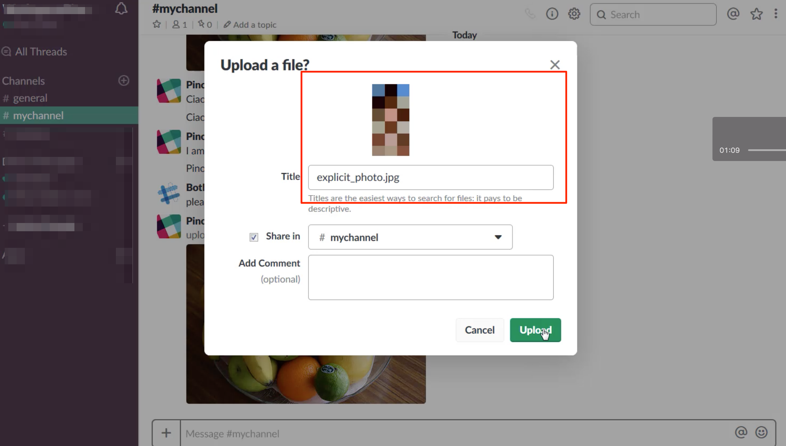

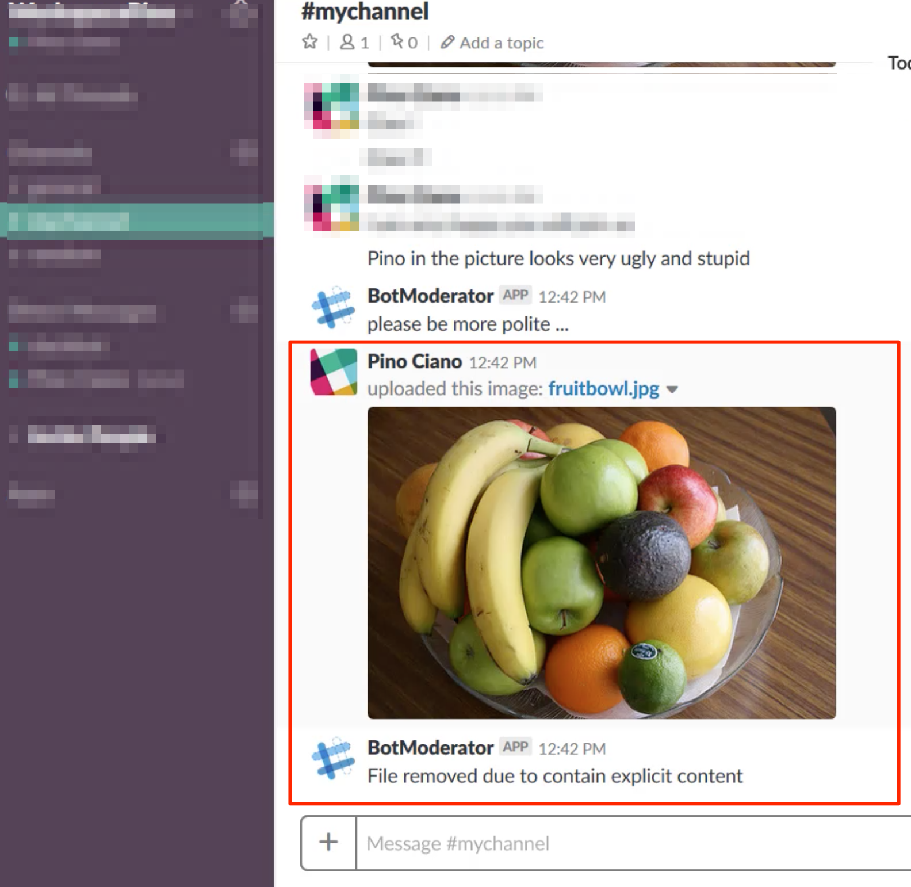 -->

# Sample Output

> Note: The video shows the Slack bot using Watson Visual Recognition to remove explicit images. Currently Watson Visual Recognition is discontinued. Existing instances are supported until 1 December 2021, but as of 7 January 2021, you can't create instances. Any instance that is provisioned on 1 December 2021 will be deleted. Please view the [Maximo Visual Inspection trial](https://www.ibm.com/support/pages/ibm-maximo-visual-inspection) as a way to get started with image classification.


## Troubleshooting

* You can monitor logs and see the output of the each request and/or call to function from the `monitor` page of the function.
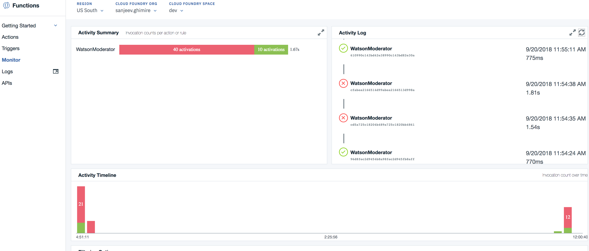

* You can change the code at runtime and run the function, by clicking `Code` from left navigation menu of the function page. It will open up an editor with the code which you can change and save. To run click `Invoke`.
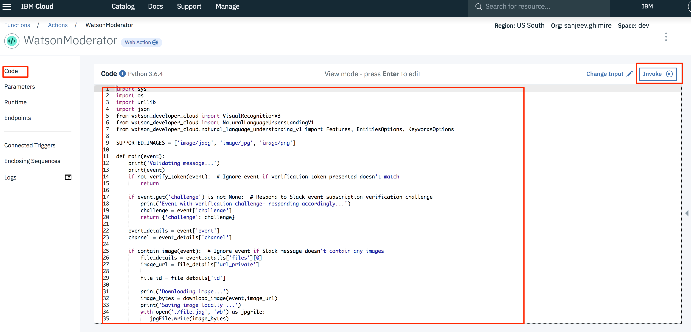

* You can also change parameters at runtime by clicking `Parameters` from left navigation menu of the function page.
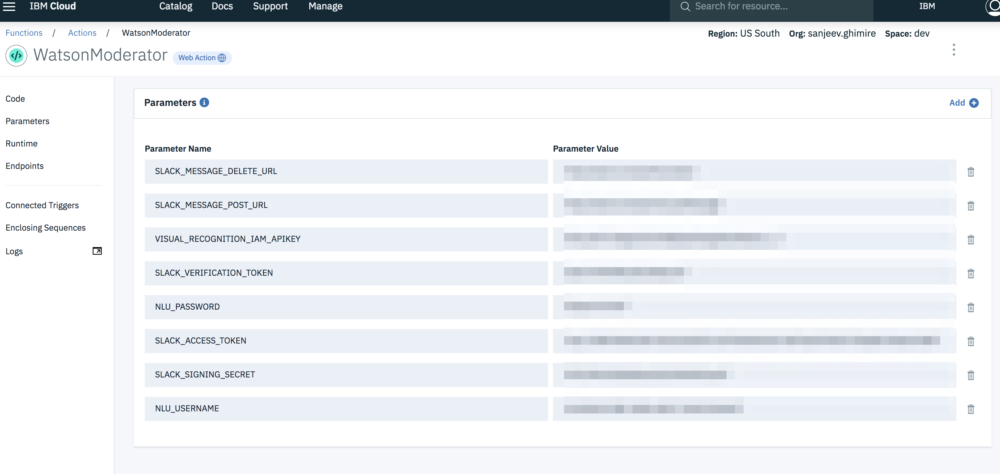

# Links

* [IBM Cloud Functions](https://cloud.ibm.com/docs/openwhisk/index.html#getting-started-with-cloud-functions) - Getting started with IBM Cloud functions
* [Watson Node.js SDK](https://github.com/watson-developer-cloud/node-sdk): Visit the Node.js library to access IBM Watson services.
* [Sample Node.js application for Language Translator](https://github.com/watson-developer-cloud/language-translator-nodejs): Sample Node.JS application for Watson Language Translator service


# Learn more

* **Artificial Intelligence Code Patterns**: Enjoyed this Code Pattern? Check out our other [AI Code Patterns](https://developer.ibm.com/technologies/artificial-intelligence/).
* **AI and Data Code Pattern Playlist**: Bookmark our [playlist](https://www.youtube.com/playlist?list=PLzUbsvIyrNfknNewObx5N7uGZ5FKH0Fde) with all of our Code Pattern videos
* **With Watson**: Want to take your Watson app to the next level? Looking to utilize Watson Brand assets? [Join the With Watson program](https://www.ibm.com/watson/with-watson/) to leverage exclusive brand, marketing, and tech resources to amplify and accelerate your Watson embedded commercial solution.

# License
This code pattern is licensed under the Apache Software License, Version 2.  Separate third party code objects invoked within this code pattern are licensed by their respective providers pursuant to their own separate licenses. Contributions are subject to the [Developer Certificate of Origin, Version 1.1 (DCO)](https://developercertificate.org/) and the [Apache Software License, Version 2](https://www.apache.org/licenses/LICENSE-2.0.txt).

[Apache Software License (ASL) FAQ](https://www.apache.org/foundation/license-faq.html#WhatDoesItMEAN)
