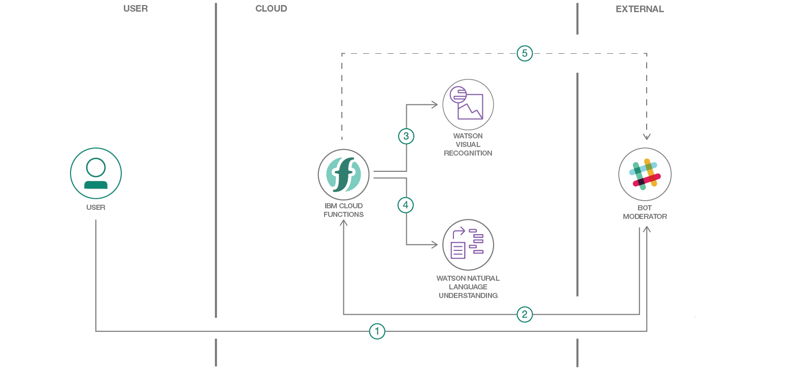

# Create a cognitive moderator chatbot for anger detection, natural language understanding and explicit images removal
In this code pattern, we will create a chatbot using IBM functions and Watson services. The chatbot flow will be enhanced by using Visual Recognition and Natural Language Understanding to identify and remove explicit images and or detect anger and ugly messages 

When the reader has completed this journey, they will understand how to:

* Create a chatbot that integrates with Slack via IBM Functions
* Use Watson Visual Recognition to detect explicit images (in beta)
* Use Watson Natural Understanding to detect emotions in a conversation
* Identify entities with Watson Natural Language Understanding

## Flow
1. The user interacts from the Slack app and either sends a text or uploads an image.
2. The text or image that is used in the Slack for conversation is then passed to an IBM function API by a bot. 
3. The API is a call to an IBM Function that categorizes the text or images based on the response of Watson Visual Recognition or Watson Natural Language Processing.
4. Watson Visual Recognition categorizes the uploaded image using default and explicit classifier.
5. Watson Natural Language Processing categorizes the text, if text is send as part of slack communication.
6. IBM function then gets the response and if the text is not polite, a message is sent by the bot to the Slack user to be more polite using [Slack post message API](https://api.slack.com/methods/chat.postMessage). If the image used is explicit, the image will be deleted by the IBM function using [Slack files delete API](https://api.slack.com/methods/files.delete).

## Included components

* [IBM Functions](https://console.bluemix.net/openwhisk/): IBM Cloud Functions (based on Apache OpenWhisk) is a Function-as-a-Service (FaaS) platform which executes functions in response to incoming events and costs nothing when not in use.
* [IBM Watson Visual Recognition](https://www.ibm.com/watson/services/visual-recognition/): Quickly and accurately tag, classify and train visual content using machine learning.
* [IBM Watson Natural Language Understanding](https://www.ibm.com/watson/developercloud/natural-language-understanding.html): Analyze text to extract meta-data from content such as concepts, entities, keywords, categories, sentiment, emotion, relations, semantic roles, using natural language understanding.

## Featured technologies

* [Slack Apps](https://api.slack.com/slack-apps) Customize functionality for your own workspace or build a beautiful bot to share with the world.
* [Slack Bots](https://api.slack.com/bot-users) Enable conversations between users and apps in Slack by building bots.

## Watch the Video

TBD

## Steps

Use the ``Deploy to IBM Cloud`` button **OR** create the services and run locally.
...
...

## With Watson

Want to take your Watson app to the next level? Looking to leverage Watson Brand assets? Join the [With Watson](https://www.ibm.com/watson/with-watson) program which provides exclusive brand, marketing, and tech resources to amplify and accelerate your Watson embedded commercial solution.